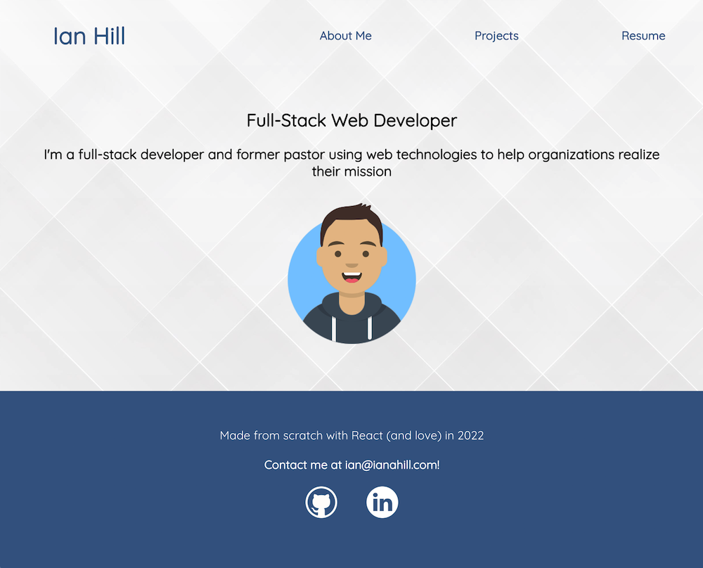

# Professional Portfolio Project

This was one of the final projects of my full-stack development certification to launch my professional career as a developer. My portfolio is not only a place to showcase my projects, but is itself a project to demonstrate my skill as a developer! 

This was the first project I developed using React. It was an opportuity to learn a new, widely-used technology while working a project that is very important to me and that I wanted to be really polished. In the process, I learned a lot about custom domains and DNS settings to use my personal domain with GitHub pages. 

For future development, I plan to implement a contact form, as well as continue to add and update my latest projects. 

## Installation and Running the Project 

In the project terminal, you can run:

### `npm i`
Downloads necessary dependencies and packages
### `npm start`
Automatically runs and opens the app in your browser.

## Link to Deployed App
[www.ianahill.com](https://www.ianahill.com)

## Screenshot
